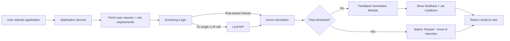
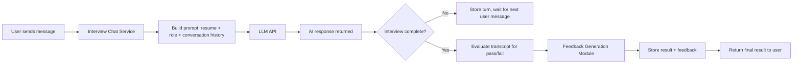
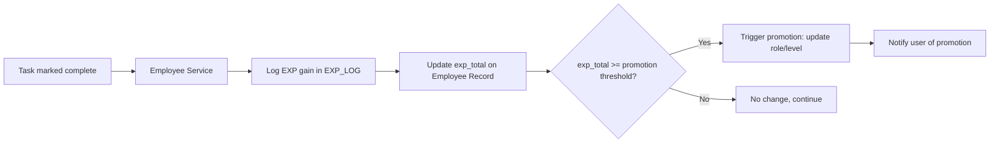

# Data Flow Diagrams

## Flow 1: Resume Screening

## Flow 2: Interview Chat Pipeline

## Flow 3: EXP → Promotion

## Notes

- The screening and interview flows both route through the same LLM API and the same Feedback Generation Module — this reuse is intentional to keep prompt logic and feedback tone consistent, and to avoid three separate teams building three separate feedback systems.
- Promotion flow is deliberately simple (threshold-based) for MVP; the "Should Have" review-cycle gate would insert a review step between D and F above.
