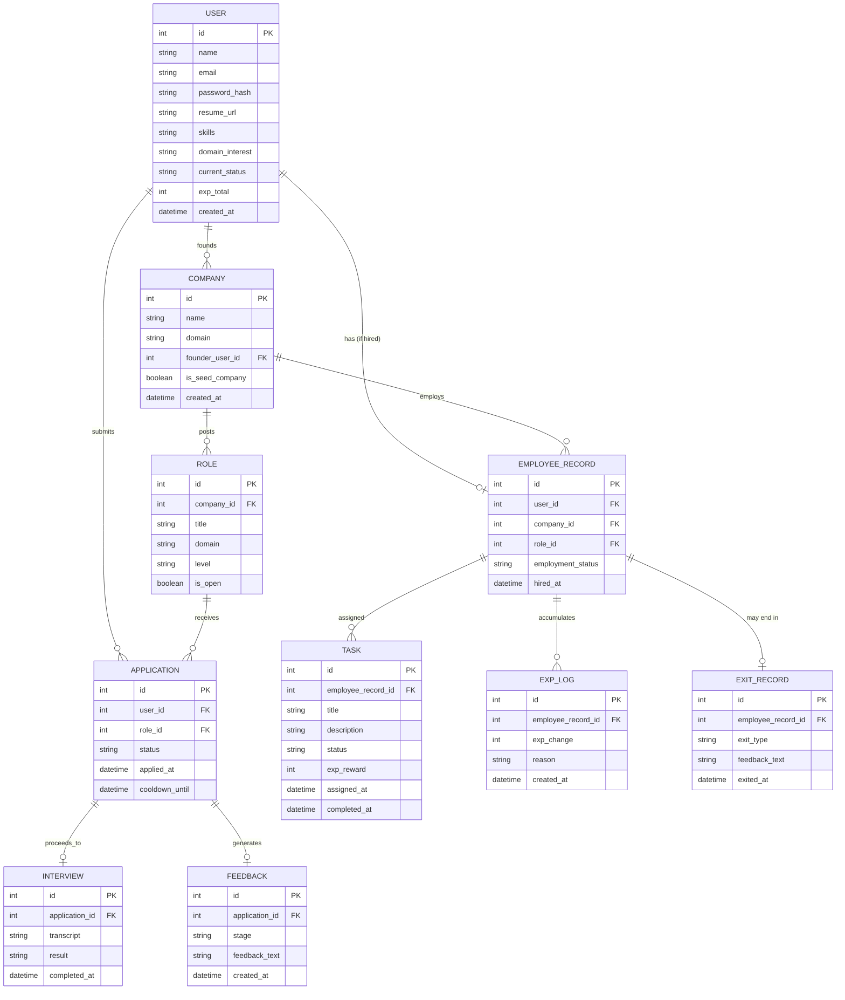

# Database Schema / ER Diagram

## Entities & Relationships

## Notes on Key Decisions

- **`current_status` on USER** tracks the state-machine value discussed in the structure doc: `job_seeker`, `employee`, or `founder` — enforced at the application layer so a user can't be in two states at once (MVP scope: one active role).
- **`is_seed_company` on COMPANY** distinguishes the 5 pre-built AI companies from real user-founded ones, so the differentiated hiring-strictness logic (from the structure doc) can branch on this flag.
- **`cooldown_until` on APPLICATION** enforces the reapplication cooldown directly at the data layer rather than trusting the frontend to block resubmission.
- **`FEEDBACK` is a separate table**, not embedded in APPLICATION or EXIT_RECORD, since the same shared feedback-generation module writes to it from multiple flows (screening rejection, interview rejection, exit).
- Kept intentionally flat/simple for MVP — no separate `TRAINING`, `PROMOTION_REVIEW`, or `REPUTATION` tables yet, since those are Should-Have/Nice-to-Have features. Adding them later just means new tables, not restructuring existing ones.
