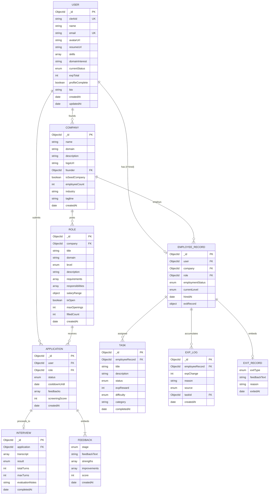

# Database Schema — MongoDB Document Model

## Architecture Decision: Why Document-Oriented

CorpVerse uses **MongoDB Atlas** with **Mongoose ODM** instead of a relational database. Key reasons:

1. **API-shape alignment** — MongoDB documents map directly to JSON API responses, eliminating ORM transformation overhead
2. **Flexible schema** — new fields can be added during development without migration scripts
3. **Strategic embedding** — related data accessed together (feedback inside applications, exit records inside employee records) is co-located for single-query retrieval
4. **Cloud-native** — MongoDB Atlas provides a zero-setup, free-tier cloud database with identical connection strings for all teammates

## Embedding vs. Referencing Strategy

| Data | Strategy | Rationale |
|---|---|---|
| Feedback → Application | **Embedded** (sub-document array) | Always read with the application; max 2-3 per app; bounded growth |
| ExitRecord → EmployeeRecord | **Embedded** (sub-document) | 1:1 relationship; always accessed together |
| Interview transcript messages | **Embedded** in Interview document | Always read as a complete conversation |
| Tasks → EmployeeRecord | **Referenced** (separate collection) | Unbounded growth; queried independently for dashboard |
| ExpLogs → EmployeeRecord | **Referenced** (separate collection) | Append-only audit log; unbounded; queried with pagination |
| Roles → Company | **Referenced** (separate collection) | Queried independently by job seekers browsing roles |

## Collections & Schema

### 8 Collections

## Enum Values Reference

| Field | Valid Values |
|---|---|
| `User.currentStatus` | `job_seeker`, `employee`, `founder` |
| `Role.level` / `EmployeeRecord.currentLevel` | `junior`, `mid`, `senior` |
| `Application.status` | `pending_screening`, `screening_passed`, `screening_rejected`, `interview_in_progress`, `interview_passed`, `interview_rejected`, `offer_pending`, `offer_accepted`, `offer_declined` |
| `Interview.result` | `passed`, `failed`, `in_progress` |
| `Feedback.stage` | `screening`, `interview`, `exit` |
| `EmployeeRecord.employmentStatus` | `active`, `resigned`, `terminated` |
| `Task.status` | `assigned`, `in_progress`, `completed` |
| `Task.difficulty` | `easy`, `medium`, `hard` |
| `ExitRecord.exitType` | `resignation`, `termination` |
| `ExpLog.source` | `task_completion`, `promotion_bonus`, `performance_review`, `penalty`, `other` |

## Indexes

| Collection | Index | Purpose |
|---|---|---|
| User | `{ clerkId: 1 }` unique | Fast lookup from Clerk webhook/auth |
| User | `{ email: 1 }` unique | Prevent duplicate accounts |
| Company | `{ domain: 1 }` | Domain filter on browse |
| Company | `{ isSeedCompany: 1 }` | Separate seed from user-founded |
| Role | `{ company: 1, isOpen: 1 }` compound | Browse open roles by company |
| Role | `{ domain: 1, isOpen: 1 }` compound | Domain filter on job search |
| Application | `{ user: 1, role: 1 }` partial unique | Prevent duplicate active applications |
| Application | `{ user: 1, status: 1 }` compound | User's application history |
| EmployeeRecord | `{ user: 1, employmentStatus: 1 }` | Find active employment |
| Task | `{ employeeRecord: 1, status: 1 }` | Dashboard task list |
| ExpLog | `{ employeeRecord: 1, createdAt: -1 }` | EXP history (newest first) |

## Notes on Key Decisions

- **`currentStatus` on User** enforces the single-active-role state machine at the application layer — a user cannot be `employee` and `founder` simultaneously.
- **`isSeedCompany` on Company** distinguishes the 5 pre-built AI companies from user-founded ones, allowing differentiated behavior (e.g., seed companies always have open roles).
- **`cooldownUntil` on Application** enforces reapplication cooldown at the data layer rather than trusting the frontend.
- **`feedbacks` embedded in Application** — the same Feedback Generation Module writes to this array from screening, interview, and exit flows, keeping feedback co-located with the application it belongs to.
- **`exitRecord` embedded in EmployeeRecord** — 1:1 relationship, always accessed together, and never needs independent querying.
- Schema is intentionally **extensible** — adding Should-Have features (training, periodic reviews, reputation) means new collections or new fields, not restructuring existing data.
