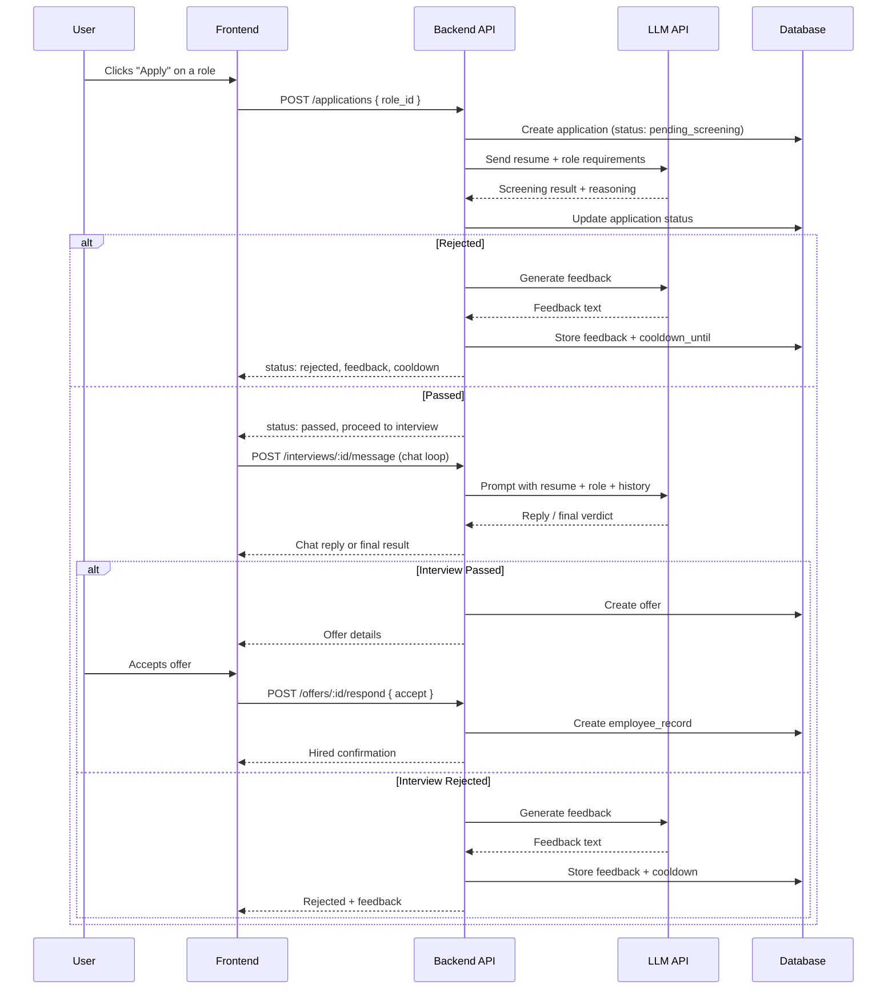
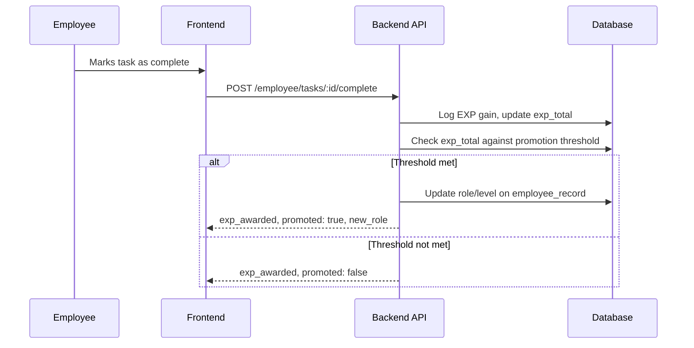
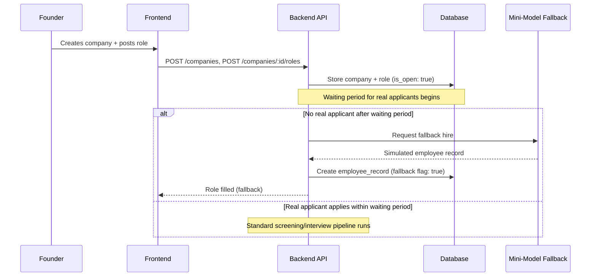

# Sequence Diagrams

## Sequence 1: Apply → Screening → Interview → Offer

```mermaid
sequenceDiagram
    participant U as User
    participant FE as Frontend
    participant BE as Backend API
    participant AI as LLM API
    participant DB as Database

    U->>FE: Clicks "Apply" on a role
    FE->>BE: POST /applications { role_id }
    BE->>DB: Create application (status: pending_screening)
    BE->>AI: Send resume + role requirements
    AI-->>BE: Screening result + reasoning
    BE->>DB: Update application status
    alt Rejected
        BE->>AI: Generate feedback
        AI-->>BE: Feedback text
        BE->>DB: Store feedback + cooldown_until
        BE-->>FE: status: rejected, feedback, cooldown
    else Passed
        BE-->>FE: status: passed, proceed to interview
        FE->>BE: POST /interviews/:id/message (chat loop)
        BE->>AI: Prompt with resume + role + history
        AI-->>BE: Reply / final verdict
        BE-->>FE: Chat reply or final result
        alt Interview Passed
            BE->>DB: Create offer
            BE-->>FE: Offer details
            U->>FE: Accepts offer
            FE->>BE: POST /offers/:id/respond { accept }
            BE->>DB: Create employee_record
            BE-->>FE: Hired confirmation
        else Interview Rejected
            BE->>AI: Generate feedback
            AI-->>BE: Feedback text
            BE->>DB: Store feedback + cooldown
            BE-->>FE: Rejected + feedback
        end
    end
```

## Sequence 2: Task Completion → EXP → Promotion

```mermaid
sequenceDiagram
    participant U as Employee
    participant FE as Frontend
    participant BE as Backend API
    participant DB as Database

    U->>FE: Marks task as complete
    FE->>BE: POST /employee/tasks/:id/complete
    BE->>DB: Log EXP gain, update exp_total
    BE->>DB: Check exp_total against promotion threshold
    alt Threshold met
        BE->>DB: Update role/level on employee_record
        BE-->>FE: exp_awarded, promoted: true, new_role
    else Threshold not met
        BE-->>FE: exp_awarded, promoted: false
    end
```

## Sequence 3: Founder Creates Company & Hires (Fallback Case)

```mermaid
sequenceDiagram
    participant F as Founder
    participant FE as Frontend
    participant BE as Backend API
    participant DB as Database
    participant MM as Mini-Model Fallback

    F->>FE: Creates company + posts role
    FE->>BE: POST /companies, POST /companies/:id/roles
    BE->>DB: Store company + role (is_open: true)
    Note over BE,DB: Waiting period for real applicants begins
    alt No real applicant after waiting period
        BE->>MM: Request fallback hire
        MM-->>BE: Simulated employee record
        BE->>DB: Create employee_record (fallback flag: true)
        BE-->>FE: Role filled (fallback)
    else Real applicant applies within waiting period
        Note over BE: Standard screening/interview pipeline runs
    end
```
