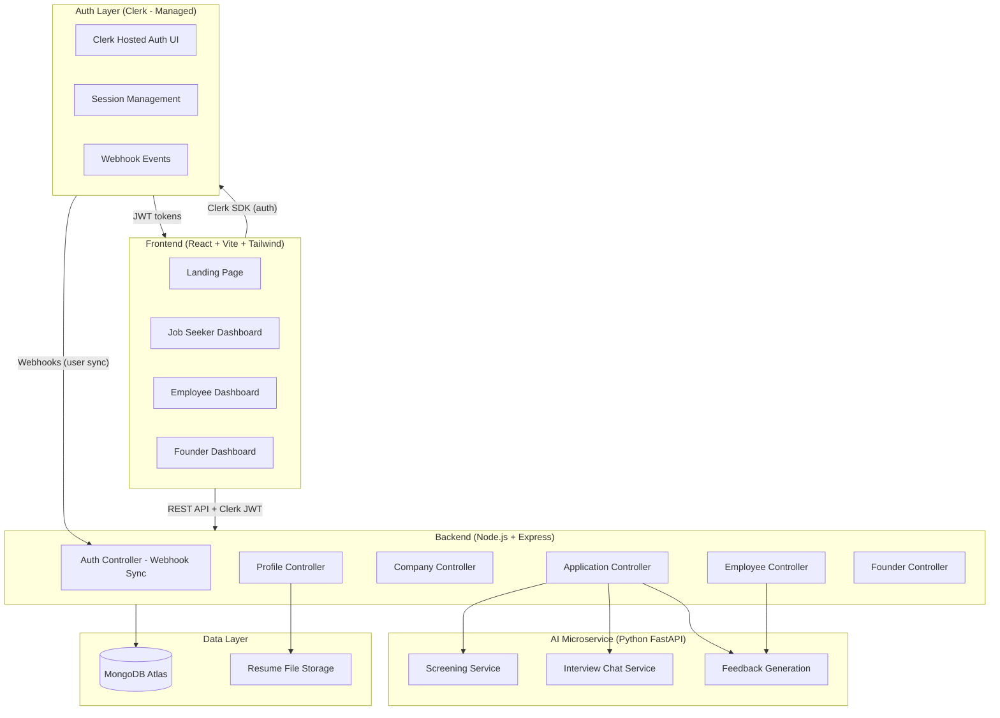
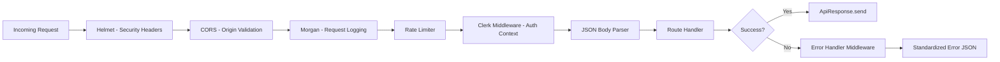

# System Architecture

## Overview

CorpVerse follows a **decoupled frontend/backend architecture** with a separate AI microservice, so the 5-person team can work in parallel without blocking each other.

## Component Responsibilities

### Frontend (React + Vite + Tailwind CSS)
| Component | Responsibility |
|---|---|
| **Landing Page** | Public page with hero, features, career journey timeline, company preview, CTA |
| **Auth Pages** | Clerk `<SignIn/>` and `<SignUp/>` components, customized to match Dark Cosmos theme |
| **Onboarding** | Profile completion flow (skills, domain interest, resume upload) |
| **Job Seeker Dashboard** | Browse companies/roles, submit applications, view application statuses + feedback |
| **Employee Dashboard** | View tasks, track EXP, see promotion progress, resign option |
| **Founder Dashboard** | Create company, post roles, view applicants |

### Auth Layer (Clerk — Fully Managed)
- **Signup/Login** — email/password + optional Google OAuth
- **Session management** — httpOnly cookies, auto-refresh, multi-device
- **Security** — email verification, password reset, brute force protection, MFA
- **Webhook events** — `user.created`, `user.updated`, `user.deleted` synced to MongoDB

### Backend (Node.js + Express)
| Service | Responsibility |
|---|---|
| **Auth Controller** | Receives Clerk webhooks, syncs users to MongoDB, returns user profile |
| **Profile Controller** | Profile completion, updates, resume upload (multer) |
| **Company Controller** | Browse companies, filter by domain, view roles — used by Job Seekers |
| **Application Controller** | Submit applications, trigger screening, manage offer flow |
| **Employee Controller** | Task management, EXP logging, promotion logic, resignation |
| **Founder Controller** | Company creation, role posting, applicant management |

### AI Microservice (Python FastAPI) — Future Phase
| Service | Responsibility |
|---|---|
| **Screening Service** | Evaluates resume against role requirements, returns score + pass/fail |
| **Interview Chat Service** | Multi-turn chat with context-aware AI interviewer |
| **Feedback Generation** | Produces constructive, specific feedback for rejections and exits |

Isolated behind its own API so the LLM provider (OpenAI, Anthropic, Hugging Face) can be swapped without touching business logic.

### Data Layer
| Component | Technology | Purpose |
|---|---|---|
| **MongoDB Atlas** | Free M0 cluster | All application data — users, companies, roles, applications, tasks, EXP |
| **Resume Storage** | Local filesystem (`/uploads/`) | PDF/DOCX resume files, served as static assets |

## Middleware Pipeline

## Why This Architecture

1. **Clerk handles all auth complexity** — saves 1-2 weeks of development, handles every edge case (email verification, password reset, token rotation, brute force), and provides drop-in React components.
2. **Separate AI microservice** — if API costs or rate limits become an issue mid-project, the team can swap providers or fall back to rule-based logic for the demo without rewriting the Express backend.
3. **MongoDB Atlas** — zero-setup cloud database with the same connection string for all teammates, eliminating "works on my machine" database issues.
4. **Express middleware pipeline** — security (Helmet), CORS, logging, rate limiting, and auth are all composable middleware, making the request flow transparent and debuggable.
