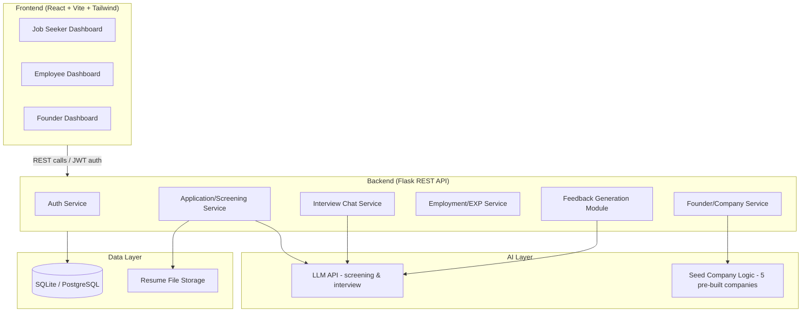

# System Architecture

## Overview

CorpVerse follows a decoupled frontend/backend architecture so the 5-person team can work in parallel without blocking each other.

## Component Notes

- **Auth Service** — handles signup/login, JWT issuing, and session validation.
- **Application/Screening Service** — receives job applications, triggers screening logic (rule-based check or single LLM call), stores result.
- **Interview Chat Service** — manages the back-and-forth chat interview, likely via Flask-SocketIO or simple polling for the MVP.
- **Employment/EXP Service** — tracks tasks, EXP totals, promotion thresholds, resignation/termination state.
- **Founder/Company Service** — handles company creation, role posting, and the simplified founder-side hiring pipeline.
- **Feedback Generation Module** — single shared service called by screening, interview, and exit flows so feedback tone/structure stays consistent (avoids duplicating prompt logic three times).
- **AI Layer** — isolated behind an internal API so the actual LLM provider (Anthropic, OpenAI, or open-source via Hugging Face) can be swapped without touching business logic elsewhere.

## Why This Split

Keeping the AI layer behind its own internal boundary means if API costs or rate limits become an issue mid-project, the team can swap providers or fall back to rule-based logic for the demo without rewriting the screening/interview services themselves.
