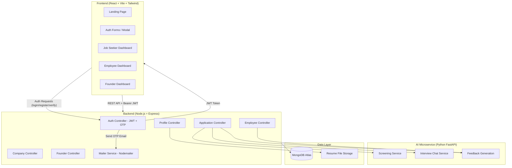
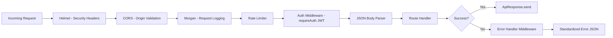

# System Architecture

## Overview

CorpVerse follows a **decoupled frontend/backend architecture** with a separate AI microservice, so the 5-person team can work in parallel without blocking each other.

```mermaid
flowchart TB
    subgraph Client["Frontend (React + Vite + Tailwind)"]
        A1[Landing Page]
        A2[Auth Forms / Modal]
        A3[Job Seeker Dashboard]
        A4[Employee Dashboard]
        A5[Founder Dashboard]
    end

    subgraph Backend["Backend (Node.js + Express)"]
        B1[Auth Controller - JWT + OTP]
        B2[Profile Controller]
        B3[Company Controller]
        B4[Application Controller]
        B5[Employee Controller]
        B6[Founder Controller]
        B7[Mailer Service - Nodemailer]
    end

    subgraph AI["AI Microservice (Python FastAPI)"]
        C1[Screening Service]
        C2[Interview Chat Service]
        C3[Feedback Generation]
    end

    subgraph Data["Data Layer"]
        D1[(MongoDB Atlas)]
        D2[Resume File Storage]
    end

    Client -->|"Auth Requests (login/register/verify)"| B1
    B1 -->|"Send OTP Email"| B7
    B1 -->|"JWT Token"| Client
    Client -->|"REST API + Bearer JWT"| Backend
    B4 --> C1
    B4 --> C2
    B4 --> C3
    B5 --> C3
    Backend --> D1
    B2 --> D2
```

## Component Responsibilities

### Frontend (React + Vite + Tailwind CSS)
| Component | Responsibility |
|---|---|
| **Landing Page** | Public page with hero, features, career journey timeline, company preview, CTA |
| **Auth Forms** | Custom Login, Register, and OTP Verification modals / forms hooked to AuthContext |
| **Onboarding** | Profile completion flow (skills, domain interest, resume upload) |
| **Job Seeker Dashboard** | Browse companies/roles, submit applications, view application statuses + feedback |
| **Employee Dashboard** | View tasks, track EXP, see promotion progress, resign option |
| **Founder Dashboard** | Create company, post roles, view applicants |

### Auth Layer (Custom JWT + OTP Verification)
- **Signup/Login** — Email/password with bcrypt hashing (10 salt rounds)
- **Email Verification** — 6-digit one-time password (OTP) generated and emailed via Nodemailer
- **Session management** — Cryptographically signed JWT tokens passed via Authorization Bearer headers
- **Security** — Zod validation, bcrypt password hashing, and express-rate-limit brute force guards

### Backend (Node.js + Express)
| Service | Responsibility |
|---|---|
| **Auth Controller** | User registration, login authentication, email OTP verification, token issue |
| **Profile Controller** | Profile completion, updates, resume upload (multer) |
| **Company Controller** | Browse companies, filter by domain, view roles — used by Job Seekers |
| **Application Controller** | Submit applications, trigger screening, manage offer flow |
| **Employee Controller** | Task management, EXP logging, promotion logic, resignation |
| **Founder Controller** | Company creation, role posting, applicant management |

### AI Microservice (Python FastAPI) — Future Phase
| Service | Responsibility |
|---|---|
| **Screening Service** | Evaluates resume against role requirements, returns score + pass/fail |
| **Interview Chat Service** | Multi-turn chat with context-aware AI interviewer |
| **Feedback Generation** | Produces constructive, specific feedback for rejections and exits |

Isolated behind its own API so the LLM provider (OpenAI, Anthropic, Hugging Face) can be swapped without touching business logic.

### Data Layer
| Component | Technology | Purpose |
|---|---|---|
| **MongoDB Atlas** | Free M0 cluster | All application data — users, companies, roles, applications, tasks, EXP |
| **Resume Storage** | Local filesystem (`/uploads/`) | PDF/DOCX resume files, served as static assets |

## Middleware Pipeline

```mermaid
flowchart LR
    A[Incoming Request] --> B[Helmet - Security Headers]
    B --> C[CORS - Origin Validation]
    C --> D[Morgan - Request Logging]
    D --> E[Rate Limiter]
    E --> F[Auth Middleware - requireAuth JWT]
    F --> G[JSON Body Parser]
    G --> H[Route Handler]
    H --> I{Success?}
    I -->|Yes| J[ApiResponse.send]
    I -->|No| K[Error Handler Middleware]
    K --> L[Standardized Error JSON]
```

## Why This Architecture

1. **Custom JWT auth provides full data ownership** — zero external vendor lock-in, complete control over user fields and verification flows, and fast local and cloud testing.
2. **Separate AI microservice** — if API costs or rate limits become an issue mid-project, the team can swap providers or fall back to rule-based logic for the demo without rewriting the Express backend.
3. **MongoDB Atlas** — zero-setup cloud database with the same connection string for all teammates, eliminating "works on my machine" database issues.
4. **Express middleware pipeline** — security (Helmet), CORS, logging, rate limiting, and auth are all composable middleware, making the request flow transparent and debuggable.
